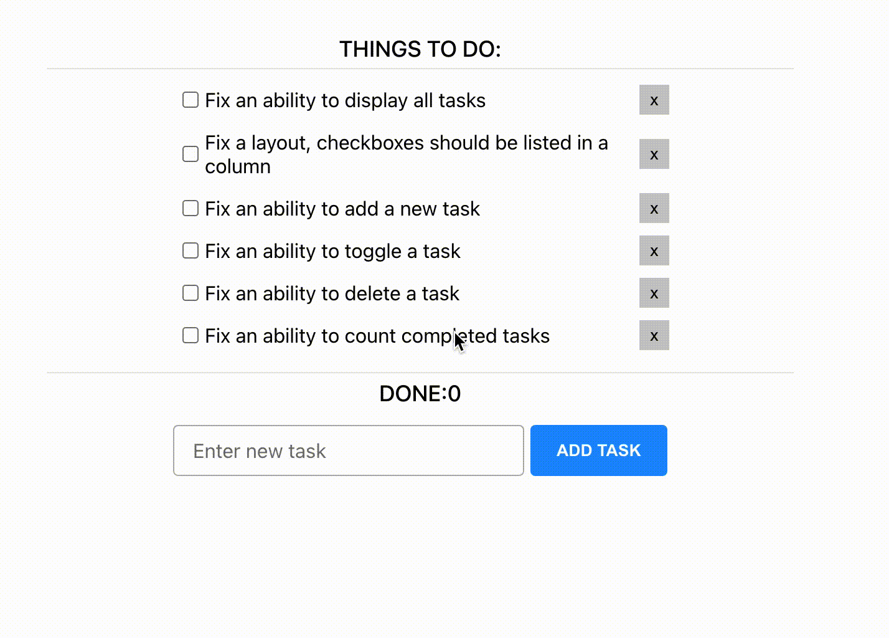

# Todo app

- Determine why code is broken and what steps are needed to perform to fix an application
- Talk about steps is about to perform
- Fix most of the critical issues in the application

The end result 
